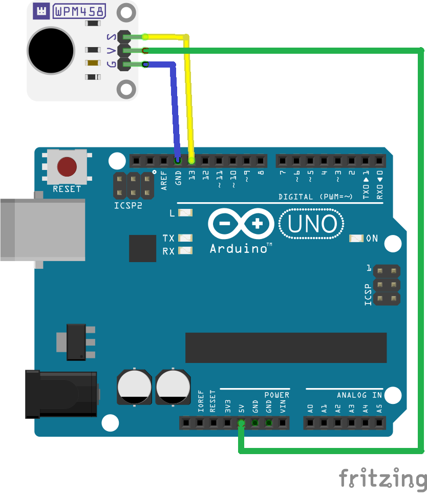

# WPSE477 Force sensing resistor sensor module

This example shows how to measure the output of HC-SR05 ultrasonic distance sensor with an Arduino® compatible board.
The example program prints the distance between the sensor and an object.

## Library dependencies
* None

## Wiring diagram

## Additional information
  For more information about the Whadda WPSE306 HC-SR05 ultrasonic distance sensor, check the manual available at [whadda.com](https://whadda.com)

